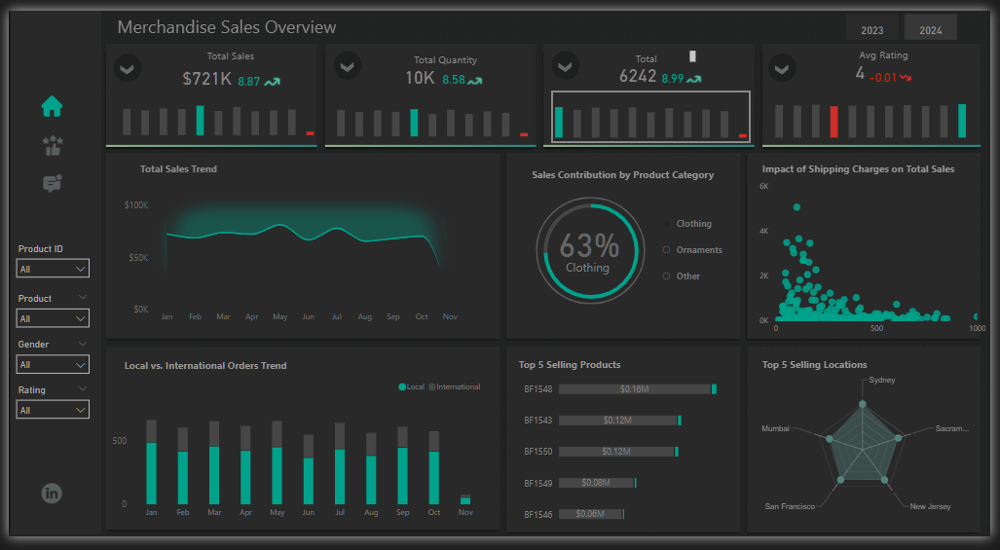
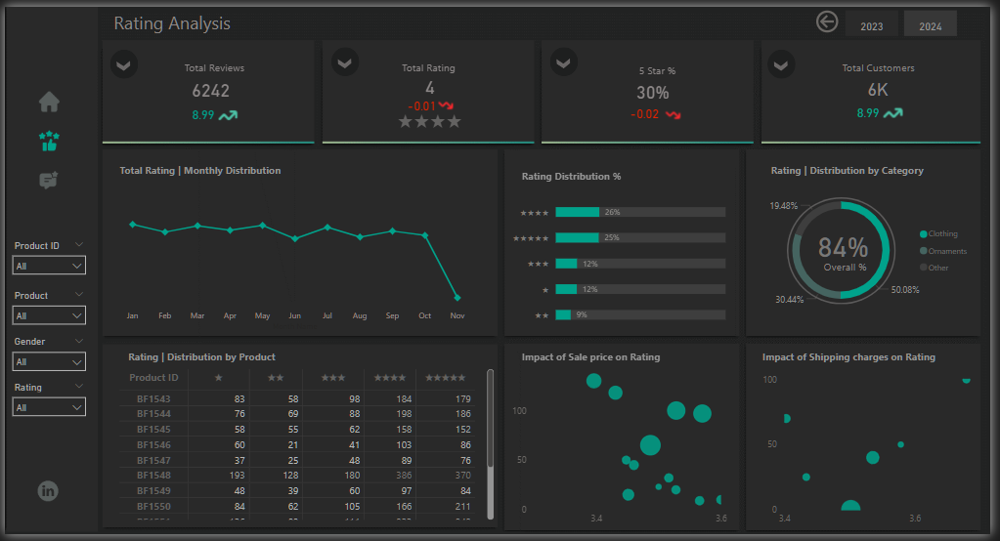
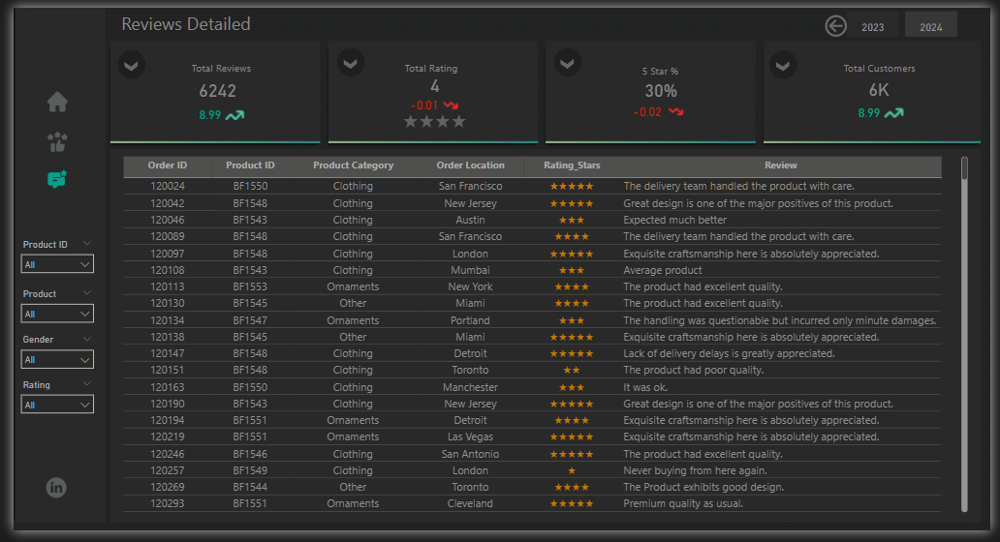

# Merchandise Sales and Customer Review Analysis using Power BI

## Introduction
In today’s highly competitive retail landscape, gaining actionable insights from sales and customer feedback is crucial to maintaining profitability and customer satisfaction. This project involves building an interactive Power BI dashboard to analyze merchandise sales performance, customer ratings, and detailed reviews across various products and regions. The aim is to provide management with a comprehensive overview to support strategic business decisions.

## About the Dataset
The dataset comprises two key data categories:
- Sales Data – Includes metrics such as total sales amount, quantity sold, sales trends, products, and locations.
- Customer Ratings and Reviews – Covers total ratings, star rating distribution, monthly trends, and customer feedback.
The dataset spans multiple months, capturing product categories such as Clothing, Ornaments, and Others across both local and international orders.

## Problem Statement
The business needed a clear and interactive way to:
- Monitor and evaluate merchandise sales performance over time.
- Understand the impact of external factors like shipping charges and sale prices on ratings and sales.
- Identify top-performing products and locations.
- Evaluate customer satisfaction through rating analysis and review insights.

## Power BI Concepts Applied
To achieve the goals, the following Power BI concepts were employed:
- Data Transformation with Power Query: Cleaned, reshaped, and filtered the data for optimal performance.
- Data Modeling: Created relationships between multiple tables (Sales, Ratings, Reviews).
- DAX (Data Analysis Expressions): Used for calculated columns and KPIs like average rating, percentage change, and sales contribution.
- Slicers and Filters: Enabled drill-down capability by Product ID, Product Category, Gender, and Rating.
- Custom Visuals: Used radial charts, stacked bar charts, line graphs, and scatter plots to provide clear visual storytelling.

## Data Modeling
The data model consists of multiple interconnected tables:
- Fact Table: Sales and Reviews data serving as the central data repository.
- Dimension Tables: Products, Locations, Rating Categories, and Time.
- Relationships are defined based on fields like Product ID and Date, allowing seamless interaction across all visuals.

## Visualization
The dashboard is divided into three key views:

### 1. Merchandise Sales Overview
- KPIs: Total Sales ($721K), Total Quantity (10K), Total Reviews (6242), Avg. Rating (4).
- Trends: Monthly Sales Trend, Local vs. International Orders.
- Top Insights: Top 5 Selling Products, Top 5 Locations, Category Contribution (63% Clothing).
- Impact Analysis: Shipping charges on total sales.

[Interact with Dashboard here](https://app.powerbi.com/view?r=eyJrIjoiNGQ0ODZmYmQtMWYwYi00MTkzLWFmMGQtMDIwYTcwNzgwZmYwIiwidCI6IjZiYjI1Yjk2LTlhZTItNDkxMy1hZTYxLThmOGE3NDNjYTY5NiJ9)

### 2. Rating Analysis
- KPIs: Total Ratings, 5-Star % (30%), Customer Count (6K).
- Trends: Monthly rating trends.
- Distributions: Rating by stars, category-wise rating.
- Impact Analysis: Sale price and shipping cost on rating.

  

### 3. Reviews Detailed
- Full table with Order ID, Product ID, Category, Order Location, Rating Stars, and Review Text.
- Supports filtering to view detailed customer feedback for each product or category.

  

## Discussion
The dashboard reveals several business-critical insights:
- Sales Performance: A positive growth trend is seen in sales and quantity sold over the months, despite a slight drop toward the year-end.
- Customer Ratings: The average rating stands at 4, though the 5-star percentage has dropped slightly (-0.02). This warrants further analysis of product and service quality.
- Shipping Impact: Both total sales and customer ratings are impacted by shipping charges, with higher charges correlating with lower ratings.
- Top Products and Locations: BF1543 and BF1548 are consistent top performers. Sydney and San Francisco are high-performing locations.

## Conclusion and Recommendation

### Conclusion
The Power BI dashboard provides an intuitive and dynamic view of the merchandise sales and customer feedback landscape. It successfully integrates sales trends, customer reviews, and rating analysis into a cohesive reporting system.

### Recommendations
- Optimize Shipping Costs: Since shipping charges negatively affect ratings and sales, consider offering free or discounted shipping for high-demand regions.
- Focus on Top Products: Promote and restock top-selling items like BF1543 and BF1548.
- Customer Feedback Loop: Use review insights to improve product quality and delivery services.
- Marketing Strategy: Leverage high-rating locations and product categories (like Clothing) in future campaigns.
- Rating Improvement: Engage with customers who leave 1–3 star ratings to gather feedback and improve satisfaction.

- Created by: James Isaac
- Built with: Power BI
- Dataset: Merchandise dataset (2023-2024)
